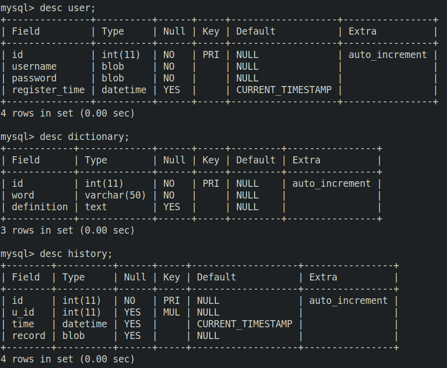

## 网络查字典项目设计

1. **技术分析**

   - 使用类封装
   - TCP网络传输
   - MySQL数据库: 
     - database: online_dict
     - tables: dictionary, user, history
   - 使用 多进程/线程/IO多路复用 网络并发模型
   
2. **通信协议**

   - 登录  
     - "L U username" 登录用户名请求
     -  "L P password" 登录密码请求
   - 注册
     - "R U username" 注册用户名请求
     - "R P password" 注册密码请求
   - 查询
     - "F W word" 查询单词解释请求
     - "F H username" 查询用户历史记录请求
   - 退出
     - "Q" 客户端退出登录
   - 通讯反馈
     - "Y response" 同意
     - "N response" 拒绝

3. **功能分析**
- 登录
     - 客户端:
       1. 发送用户名请求: "L U username"
       2. 接收服务端反馈:
          - "Y response" 同意请求
            - 进入 3
          - "N response" 拒绝请求
            - 返回 1
       3. 发送密码请求:  "L P password"
       4. 接收服务器反馈:
          - "Y response" 同意请求
            - 进入 查询界面
          - "N response" 拒绝请求
            - 返回 3
     - 服务端:
       1. 接收客户端请求
       2. 解析请求
       3. 组织反馈信息并向客户端发送
          - "Y response" 同意请求
          - "N response" 拒绝请求
       4. 发送反馈给客户端
   - 注册
     - 客户端:
       1. 发送用户名请求
       2. 接收服务端反馈
          - "Y response" 同意请求
            - 进入 3
          - "N response" 拒绝请求
            - 返回 1
       3. 发送密码请求
       4. 接收服务器反馈
          - "Y response" 同意请求
            - 进入 查询界面
          - "N response" 拒绝请求
            - 返回 3
     - 服务端:
       1. 接收客户端请求
       2. 解析请求
       3. 组织反馈信息并向客户端发送
          - "Y response" 同意请求
          - "N response" 拒绝请求
       4. 发送反馈给客户端
   - 查询
     - 客户端:
       1. 发送查询请求 "F "
       2. 接收服务端反馈
          - "Y response" 同意请求
            - 打印 反馈信息
          - "N response" 拒绝请求
            - 打印 反馈信息
     - 服务端:
       1. 接收客户端请求
       2. 解析请求
       3. 组织反馈信息
          - "Y response" 同意请求
          - "N response" 拒绝请求
       4. 发送反馈给客户端
   - 退出
     - 客户端
       1. 发送退出请求 "Q"
       2. 退出登录
     - 服务端
       1. 接收客户端请求
       2. 退出线程
   
4. **数据库表结构**

